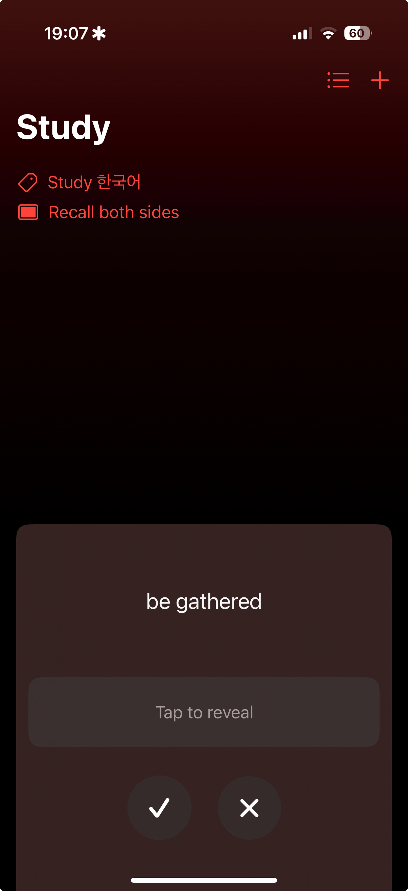
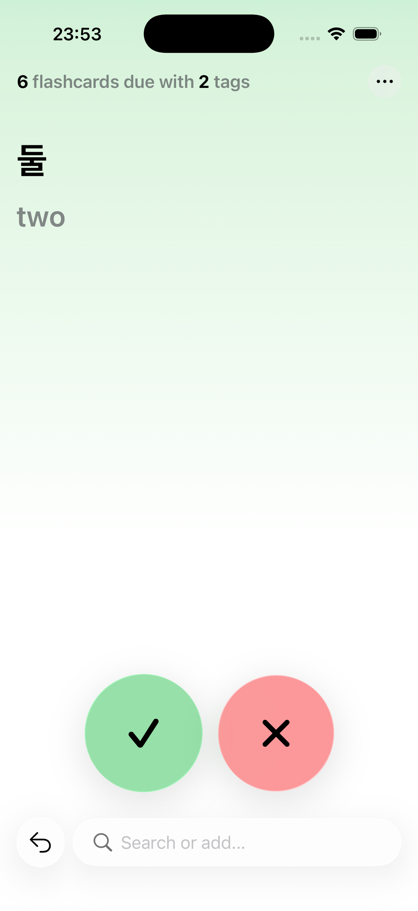
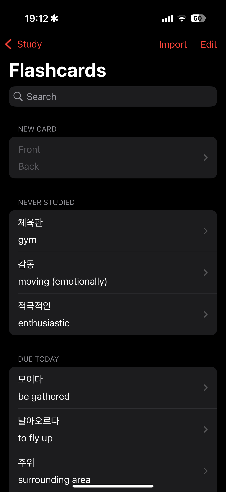
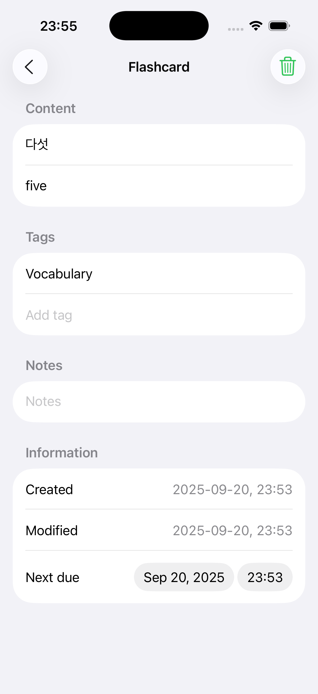
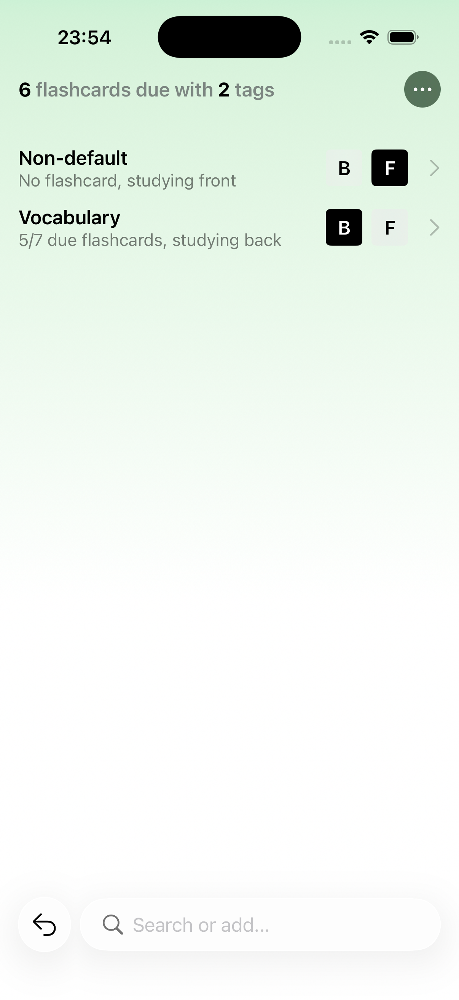

# YAFA

> Yet Another Flashcards App

A simple flashcards app for iOS.

Rather than front/back pairs, YAFA stores a graph of **terms** — words, phrases,
definitions — connected by directed **links**. A link is what gets studied:
showing its source and grading recall of its target. Because a term is written
once and linked many times, synonyms ("big" and "large" both meaning "큰") and
homographs ("차" as both "tea" and "car") don't require duplicating it. Two links
can also share one FSRS schedule, so studying EN→KO also advances KO→EN.

- Offline-first with
  [CloudKit support](https://developer.apple.com/icloud/cloudkit/).
- Organize terms with tags.
- Import from CSV.
- Export to CSV (plain term/definition pairs) or JSON (including review history).
- Spaced repetition using
  [FSRS](https://github.com/open-spaced-repetition/fsrs4anki/wiki/The-Algorithm).

The app is designed with _ease-of-use_ in mind: studying, editing and adding
terms should require as little effort as possible: there is no deck to navigate
to and no loading screen; studying takes zero tap (it is the main screen), and
adding a term takes a single tap. Yet, the usage of tags makes it simple to
filter terms when studying / editing them.

## Screenshots

|           |  |
| ------------------------------------------------------------------ | ----------------------------------------------------- |
|              |   |
|                          |                                                       |

## To-do

- [ ] Localization.
