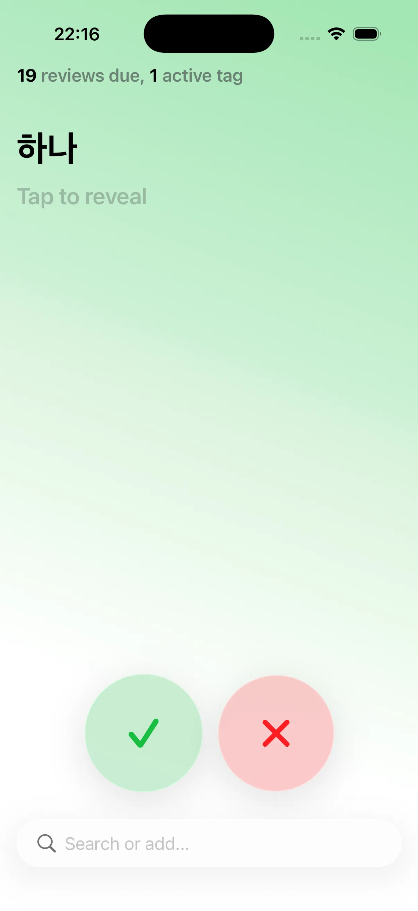
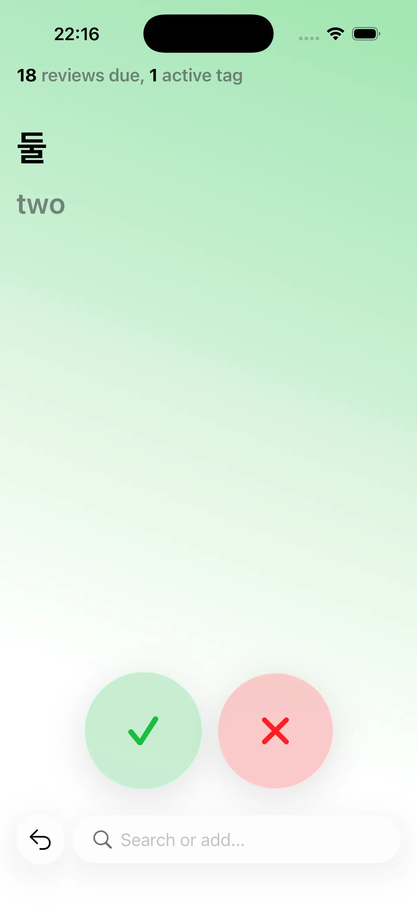
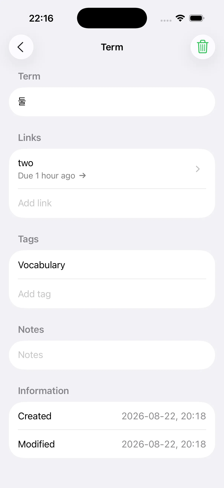
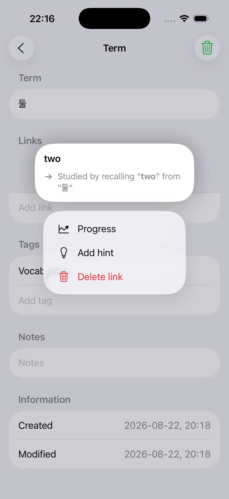
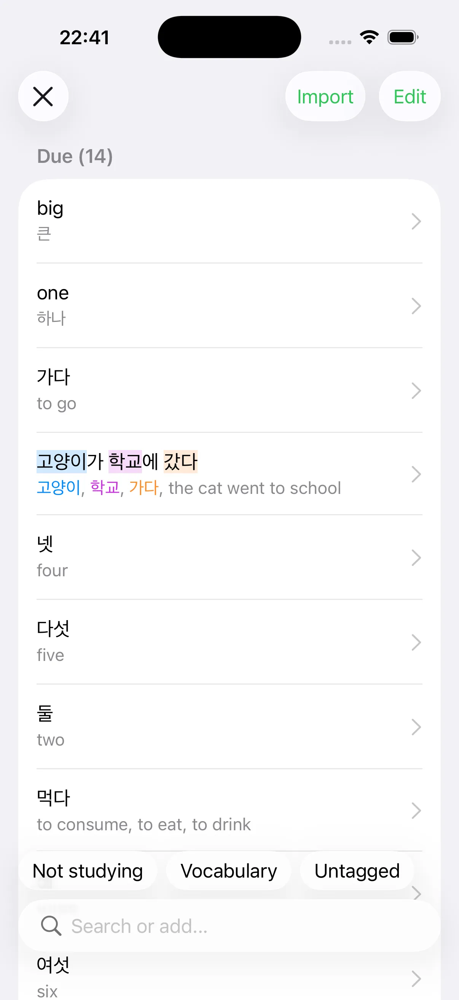
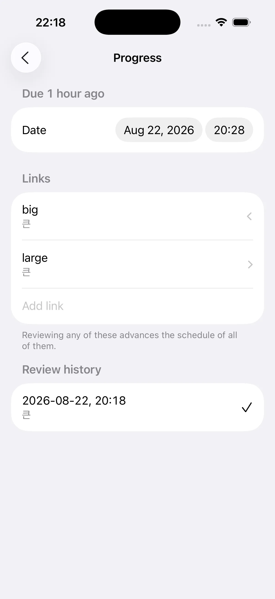
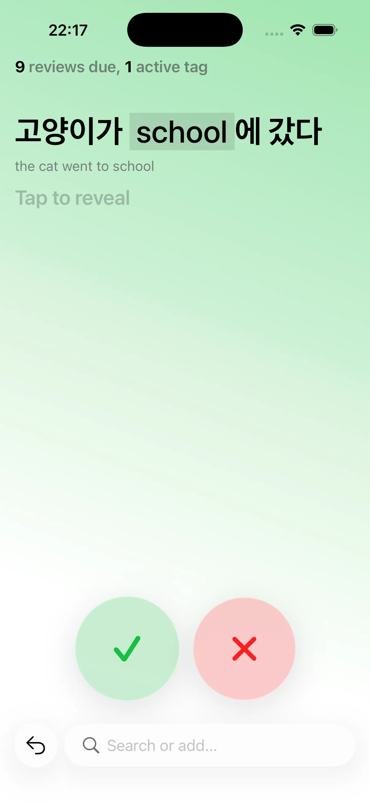
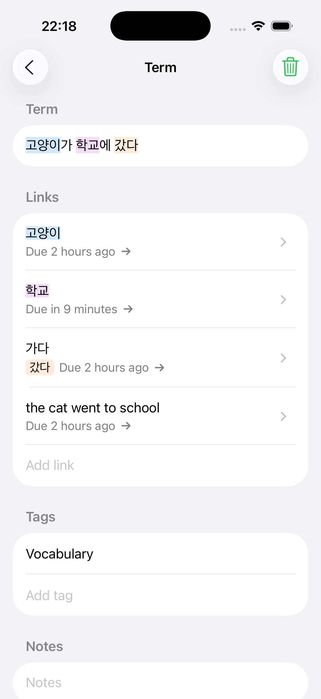
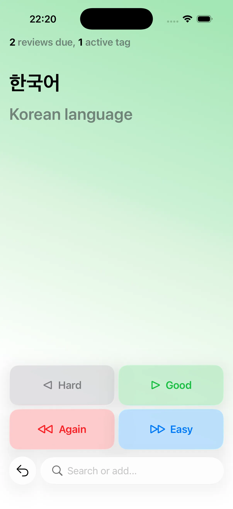
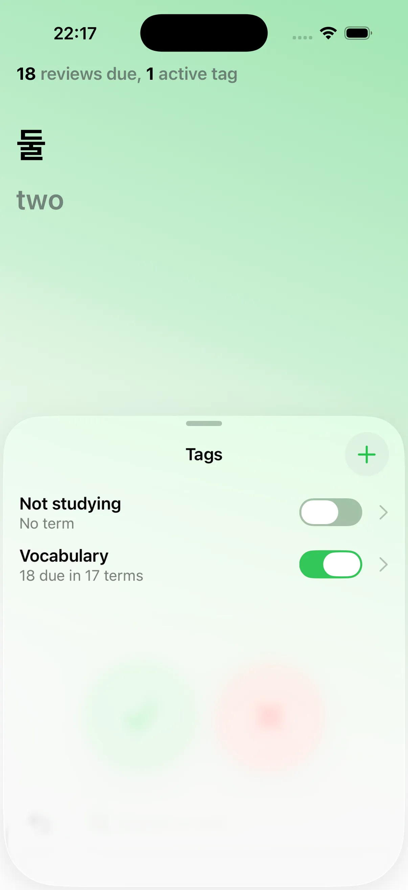

# YAFA

> Yet Another Flashcards App

A flashcards app for iOS.

- Organize terms into a [graph](#the-term-graph), and categorize them with tags.
  Cloze deletion, synonyms, and homographs can all be represented by this
  scheme.

- Offline-first with
  [CloudKit support](https://developer.apple.com/icloud/cloudkit/).

- Spaced repetition using
  [FSRS](https://github.com/open-spaced-repetition/fsrs4anki/wiki/The-Algorithm).

- Import from CSV.

- Export to CSV or JSON (the latter including review history).

The app is designed with _ease-of-use_ in mind: studying, editing and adding
terms should require as little effort as possible: there is no deck to navigate
to and no loading screen; studying takes zero tap (it is the main screen), and
adding a term takes a single tap. Yet, the usage of tags makes it simple to
filter terms when studying / editing them.

## The term graph

While the app can be used like a simple flashcards app, it is actually designed
so that all answers (typically the "front" and "back" of a flashcard) are nodes
in a graph which can refer to one another.

Let's say you start with a new term — a word, phrase, or definition:

> Rien ne sert de courir, il faut partir à point.

You first add its standard equivalent:

> Slow and steady wins the race.

But this isn't a direct translation, so you start translating parts of the
sentence: you select "sert", tap "blank", then add a link to a new term
"servir"; this _anchors_ the link to the blank. You tap the new link, and add a
first translation: "to serve", then a second: "to be of use". You go back,
select "à point", add a blank, then add two translations: "on time", and
"medium-rare."

You can now study the idiom itself, as well as several meanings of words that
are part of it. Studying a word within a single sentence tends to make you learn
the sentence itself, rather than the word, so you add a new one:

> Nul ne peut servir deux maîtres.

Again, you translate it:

> No one can serve two masters.

This time the translation is more direct. You select "servir", and tap "blank."
The term you created for "servir" above is automatically suggested. Once
selected, "servir" will be studied both via the meanings you provided above, and
via the two sentences you added in the first place.

But let's say that's too much for one word: you want to study its two meanings
separately (they are, after all, different pieces of knowledge), but either
example is fine to study its usage in a sentence. You go back to "servir",
long-press "Rien ne sert de courir, il faut partir à point.", press "Share
progress with...", then select "No one can serve two masters." Now both
sentences will share the same spaced repetition progress, and only one will be
prompted at a time. That progress (alongside historical reviews) can be observed
by swiping one of the sentences right, and pressing "Progress."

## Screenshots

|       |        |
| --------------------------------------------------------------- | ------------------------------------------------------------ |
|                      |      |
|                    |           |
|        |  |
|  |                   |
