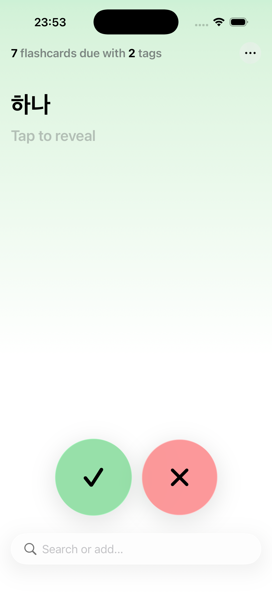
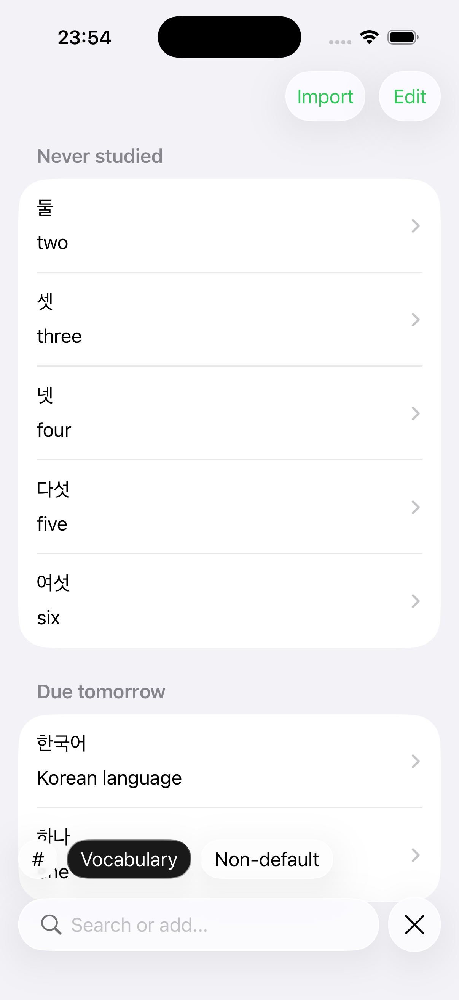

# YAFA

> Yet Another Flashcards App

A simple flashcards app for iOS.

- Offline-first with
  [CloudKit support](https://developer.apple.com/icloud/cloudkit/).
- Organize flashcards with tags.
- Import from CSV.
- Export to CSV (plain flashcards) or JSON (including review history).
- Spaced repetition using
  [FSRS](https://github.com/open-spaced-repetition/fsrs4anki/wiki/The-Algorithm).

The app is designed with _ease-of-use_ in mind: studying, editing and adding
flashcards should require as little effort as possible: there is no deck to
navigate to and no loading screen; studying flashcards takes zero tap (it is the
main screen), and adding flashcards takes a single tap. Yet, the usage of tags
makes it simple to filter flashcards when studying / editing them.

## Screenshots

|           |  |
| ------------------------------------------------------------------ | ----------------------------------------------------- |
|              |   |
|  |                                                       |

## To-do

- [ ] Localization.
